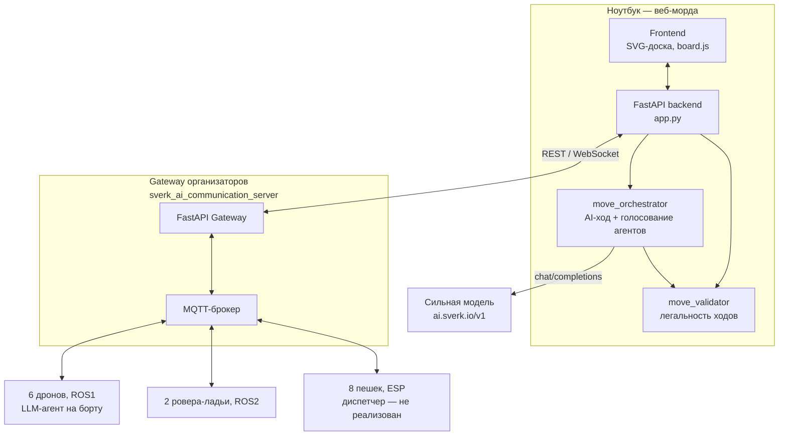

# Ход дрона: шахматные сражения роёв — 2026


Подготовка команды к очному этапу соревнования «Ход дрона: шахматные сражения
роёв» (2026): автономный шахматный матч двух гетерогенных роёв роботов —
летающих дронов и наземных роверов, — где каждый ход выбирают LLM-агенты
через переговоры. Шахматные движки для выбора хода запрещены регламентом.

Полный регламент — `Регламент_очного_этапа_Ход_дрона_20261.pdf` в корне
репозитория.

## Правила, которые определяют архитектуру

- Аппараты действуют полностью автономно; единственное ручное вмешательство —
  аварийный Kill Switch на пульте.
- Ход выбирается **исключительно** через взаимодействие LLM-агентов. Stockfish,
  Leela и любые другие движки для выбора хода — запрещены.
- Каждый аппарат — отдельный LLM-агент, кроме пешек: все 8 пешек команды
  управляет один агент-диспетчер.
- Состав: 6 дронов (King, Queen, 2×Bishop, 2×Knight, ROS1), 2 ровера-ладьи
  (ROS2), 8 роверов-пешек (ESP, без ROS).
- Упрощённые шахматы: без рокировки, взятия на проходе, превращения пешки,
  повторения позиции, правила 50 ходов. Ничьей нет.
- Лимит хода — 5 минут, лимит матча — 2 часа.

## Архитектура



**Веб-морда** — единственный источник истины по состоянию доски (позиции не
трекаются автоматически через ArUco, только хардкод + ручная коррекция) и
единственная точка входа в Gateway организаторов. Браузер никогда не ходит в
Gateway напрямую.

**move_validator** — чистый Python-пакет с правилами упрощённых шахмат
(легальность хода, шах/мат/пат), не зависит ни от веба, ни от сети.
Используется и веб-мордой, и AI-оркестратором.

**move_orchestrator** — цикл «предложение → проверка → голосование →
исполнение»: сильная модель на ноутбуке предлагает ход → локальная валидация
через `move_validator` (без сети) → рассылка предложения агентам
online-фигур на голосование (да / нет / свой вариант) → повторяющаяся
альтернатива побеждает голое вето → до двух регенераций → исполнение (в т.ч.
fail-open, если консенсус не достигнут). Подробности —
[дизайн-документ](docs/superpowers/specs/2026-07-31-ai-move-negotiation-design.md).

**Gateway** (`sverk_ai_communication_server`) — уже готовая инфраструктура
связи от организаторов: FastAPI + MQTT-брокер, реестр роботов, текстовый
request/response мост «отправитель → робот → ответ». Не входит в этот
репозиторий (см. `.gitignore`), клонируется отдельно для локальной работы.

## Структура репозитория

```
.
├── move_validator/         # правила упрощённых шахмат — чистый Python, без веба
├── web/
│   ├── backend/             # FastAPI: состояние партии, Gateway-клиент, AI-оркестратор
│   └── frontend/            # SVG-доска, drag-and-drop, лента переговоров
├── patches/sverk_drone_agent/  # патчи и конфиг для бортового агента дронов
├── docs/superpowers/specs/  # дизайн-документы по каждой крупной фиче
├── CLAUDE.md                 # контекст проекта для AI-ассистента разработки
├── MULTI_DRONE_SETUP.md      # инструкция организаторов по разворачиванию флота
└── Регламент_*.pdf           # полный регламент соревнования
```

## Быстрый старт

```bash
git clone https://github.com/nikilokser/Hod_Drona_Sokoliki_2026
cd Hod_Drona_Sokoliki_2026/web/backend

python3 -m venv .venv
.venv/bin/pip install -r requirements.txt

# опционально — для панели «Предложение хода (ИИ)»
echo "STRONG_MODEL_API_KEY=<ключ>" > .env

.venv/bin/uvicorn app:app --reload --port 8000
```

Открыть `http://127.0.0.1:8000`. Подробности по режимам поля, привязке
роботов и переменным окружения — [`web/README.md`](web/README.md).

## Тесты

```bash
cd move_validator && python3 -m pytest       # правила игры
cd web/backend && .venv/bin/pytest           # бэкенд + оркестратор
```

## Что уже сделано

- [x] Правила упрощённых шахмат: легальность хода, шах, мат, пат
      (`move_validator`)
- [x] Веб-доска: drag-and-drop, режимы наблюдение/коррекция/ручные ходы,
      таймер хода и матча, привязка робот↔фигура
- [x] Интеграция с Gateway: лента переговоров (обязательное требование
      регламента), диспетч хода на робота
- [x] Анализ позиции Stockfish — только для тренировки, с явным
      предупреждением про регламент и защитой на бэкенде
- [x] AI-оркестратор хода: предложение сильной моделью + голосование
      агентов фигур (да/нет/альтернатива) + автоматическое исполнение
- [x] Три патча к бортовому агенту дронов, найденные и исправленные при
      живом тестировании на реальном железе (см.
      [`patches/sverk_drone_agent`](patches/sverk_drone_agent))

## Открытые вопросы

- Диспетчер пешек (ESP, без ROS) — не реализован, ходы пешками пока вне
  автоматизации.
- Голосование агентов дронов требует переключения борта из отладочного
  `pseudo`-режима в реальный LLM-режим `agent` — сделано не на всех дронах.
- Агентный стек роверов (ROS2) не подтверждён рабочим на момент написания.
- Позиционирование фигур на поле — хардкод + ручная коррекция; интеграция
  с ArUco-локализацией отложена.

Подробный контекст и история решений — [`CLAUDE.md`](CLAUDE.md).
